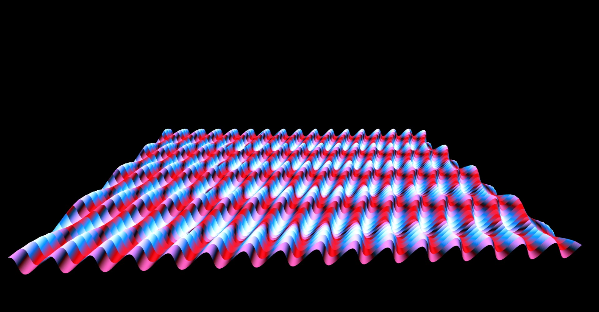
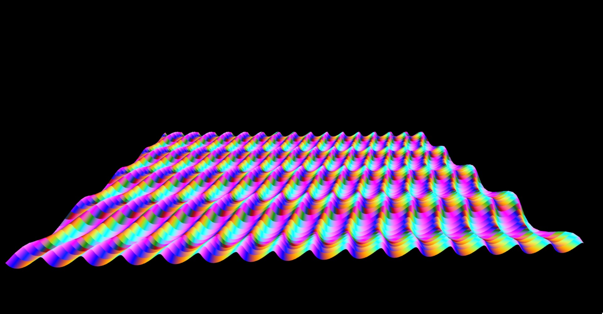

# OpenGL Demo
This is an OpenGL Demo repository, built for Windows, not testing on other OS's.

### Requirements
The only requirement is to install freeglut, which means copying over the 32-bit dll and also linking to the freeglut library file (32-bit). After doing this, one can open the .sln file in Visual Studio (2019) and it should build.

### Current State
Currently, the application shows an animated surface grid with waves and colors propagating through. The application shows an object of base class OpenGLShape. The objects are defined in the OpenGLShapes.h file.

### Screenshots

